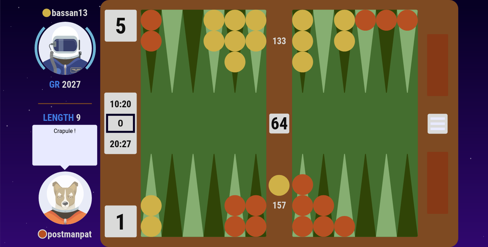

# postmanpat CSS style for BackgammonGalaxy

## Preview

## Install instructions

1. Install Stylus extension for [firefox](https://addons.mozilla.org/en-US/firefox/addon/styl-us/) or [chrome](https://chrome.google.com/webstore/detail/stylus/clngdbkpkpeebahjckkjfobafhncgmne) or [opera](https://addons.opera.com/en-gb/extensions/details/stylus/)

2. Install the [theme](https://raw.githubusercontent.com/kevung/backgammongalaxy-custom-style/master/postmanpat-sober.user.css)

3. Enjoy ;)

## Feedbacks

Do not hesitate to give your feedbacks in the [issue section](https://github.com/kevung/backgammongalaxy-custom-style/issues/new). [You need to log in with a Github account.]
